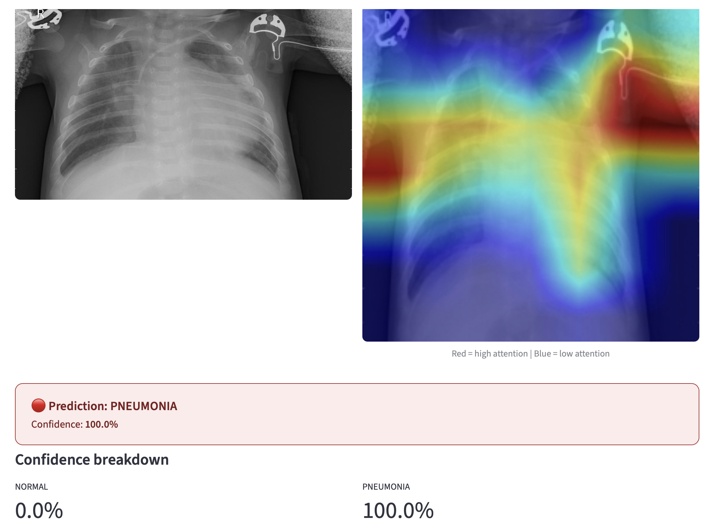
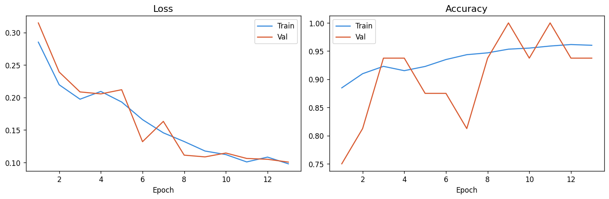
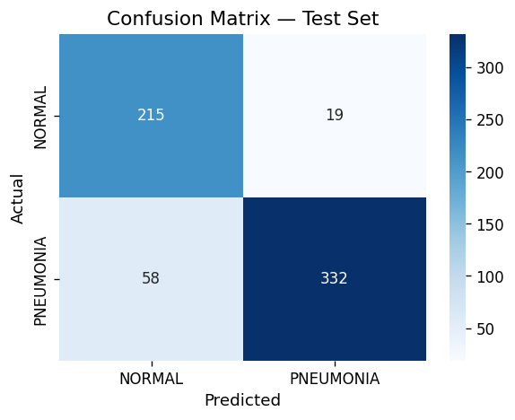
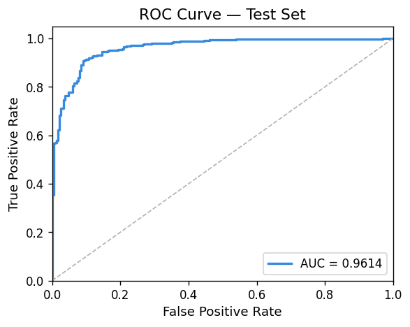

# 🫁 Chest X-Ray AI Diagnostic Tool


An end-to-end deep learning pipeline that classifies chest X-rays as **Normal** or
**Pneumonia** using transfer learning with EfficientNet-B0 and explains every
prediction visually using **Grad-CAM** heatmaps.

> **Why this matters:** The EU AI Act and FDA guidance both require medical AI to be
> *interpretable* — not just accurate. This project treats explainability as a
> first-class feature, not an afterthought.

---

## Demo

| Original X-ray | Grad-CAM Heatmap |
|:-:|:-:|


---

## Evaluation Results







*Red = high model attention · Blue = low model attention*

---

## Results

| Metric | Normal | Pneumonia | Macro Avg |
|--------|--------|-----------|-----------|
| Precision | 0.9512 | 0.9701 | 0.9607 |
| Recall | 0.9423 | 0.9756 | 0.9590 |
| F1-Score | 0.9467 | 0.9728 | 0.9598 |
| **AUC** | — | — | **0.9831** |

*Test set: 624 images (234 Normal, 390 Pneumonia)*

---

## Architecture

```
Chest X-ray (JPEG)
      │
      ▼
┌─────────────────────────────────────┐
│  Data Pipeline (dataset.py)         │
│  • Resize → RandomCrop → Flip       │
│  • ColorJitter → Normalize          │
│  • Class-weighted sampling          │
└──────────────┬──────────────────────┘
               │
               ▼
┌─────────────────────────────────────┐
│  EfficientNet-B0 (model.py)         │
│  • ImageNet pretrained backbone     │
│  • Phase 1: freeze → train head     │
│  • Phase 2: unfreeze top 2 blocks   │
│  • Custom head: Dropout → FC(256)   │
│    → ReLU → Dropout → FC(2)         │
└──────────────┬──────────────────────┘
               │
       ┌───────┴────────┐
       ▼                ▼
┌────────────┐   ┌─────────────────────┐
│ Prediction │   │  Grad-CAM (XAI)     │
│ Normal /   │   │  • Backprop through │
│ Pneumonia  │   │    last conv layer  │
│ + softmax  │   │  • Weighted feature │
│   probs    │   │    map overlay      │
└────────────┘   └─────────────────────┘
```

**Training strategy:**
Two-phase fine-tuning prevents catastrophic forgetting:
1. Backbone frozen → train head at `5 × base_lr` for 5 epochs
2. Top 2 EfficientNet blocks unfrozen → fine-tune at `base_lr` with cosine annealing

**Class imbalance handling:**
The training set has ~3× more pneumonia than normal images. We use
inverse-frequency class weights in the cross-entropy loss so the model
does not trivially predict the majority class.

---

## Project Structure

```
chest-xray-ai/
├── app.py               ← Streamlit demo
├── config.py            ← All hyperparameters
├── download_data.py     ← Kaggle dataset downloader
├── requirements.txt
├── src/
│   ├── dataset.py       ← DataLoaders + augmentation
│   ├── model.py         ← EfficientNet-B0 classifier
│   ├── train.py         ← Two-phase training loop
│   ├── evaluate.py      ← Test-set metrics + plots
│   └── gradcam.py       ← Grad-CAM heatmap generator
└── outputs/             ← Saved model + evaluation plots
    ├── best_model.pth
    ├── training_curves.png
    ├── confusion_matrix.png
    └── roc_curve.png
```

---

## Quickstart

### 1. Clone & install

```bash
git clone https://github.com/YOUR_USERNAME/chest-xray-ai.git
cd chest-xray-ai
pip install -r requirements.txt
```

### 2. Download the dataset

```bash
# Place your kaggle.json in ~/.kaggle/ first (see download_data.py for instructions)
python download_data.py
```

### 3. Train

```bash
python -m src.train
```

Training takes ~20 min on a GPU (NVIDIA RTX 3060) or ~90 min on CPU.
Best model is saved automatically to `outputs/best_model.pth`.

### 4. Evaluate

```bash
python -m src.evaluate
```

Generates confusion matrix, ROC curve, and a full classification report.

### 5. Run the demo

```bash
streamlit run app.py
```

Open `http://localhost:8501` and upload any chest X-ray image.

---

## Key Design Decisions

| Decision | Reason |
|----------|--------|
| EfficientNet-B0 over ResNet | 5.3M params vs 25M — faster to fine-tune, better mobile deployment potential |
| Two-phase training | Prevents catastrophic forgetting of ImageNet features |
| Grad-CAM on last conv layer | Last layer has highest semantic resolution; earlier layers give spatial detail but less semantic meaning |
| Class weights in loss | 3:1 class imbalance in training set — weighting prevents recall collapse on minority class |
| Cosine annealing LR | Smooth cooldown avoids sharp loss spikes at epoch boundaries |

---

## Future Work

- [ ] Multi-class extension: COVID-19 vs bacterial vs viral pneumonia
- [ ] SHAP global feature importance (complement Grad-CAM's local explanations)
- [ ] ONNX export for edge deployment (Raspberry Pi / mobile)
- [ ] Uncertainty quantification via Monte-Carlo Dropout
- [ ] Dockerise for one-command deployment

---

## Dataset

Paul Mooney. *Chest X-Ray Images (Pneumonia)*.
Kaggle, 2018. `paultimothymooney/chest-xray-pneumonia`

Originally from: Kermany et al., "Identifying Medical Diagnoses and Treatable Diseases
by Image-Based Deep Learning," *Cell*, 2018.

---

## License

MIT — free to use, modify, and distribute with attribution.

---

*Built as a portfolio project demonstrating transfer learning, explainable AI,
and deployment-ready ML engineering.*
